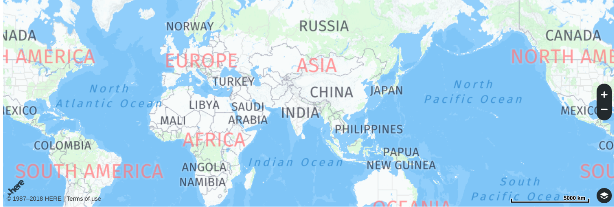
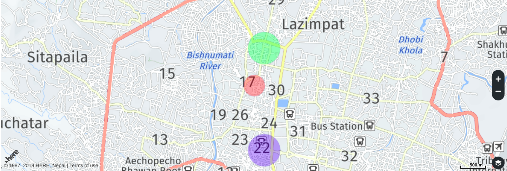
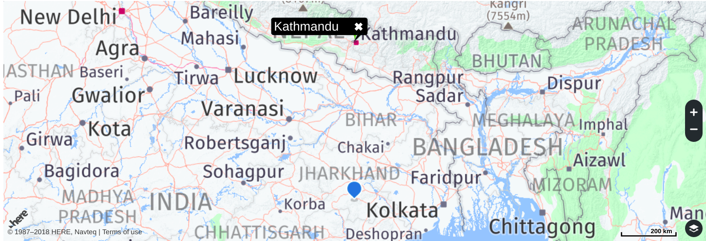
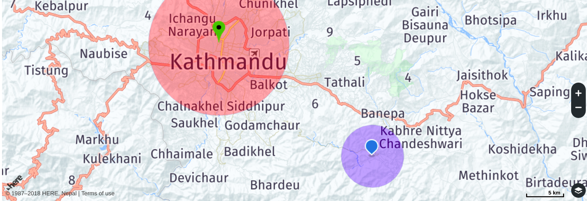

## React Here Map

### Installation
First, install library
```
  npm install --save @wolfmatrix/react-here-maps
  yarn add @wolfmatrix/react-here-maps
```
### Usage & Configuration
#### Map
<p align="center">
  
</p>

#### Example

```js
  import { HereMap } from "@wolfmatrix/react-here-maps";
  export default class Map extends Component {
    render() {
      return (
          <HereMap
            initialCenter={{ lat: 27.710769, lng: 85.31014 }}
            appConfig={{
              appId: "",
              appCode: ""
            }}
          />     
      );
    }
  }
  ```
 #### Addtional Map Props

 **zoom :** This props sets the zoom level of the map. Every zoom level represents a different scale. The map at zoom level 2 is twice as large as the map at zoom level 1.

**initialCenter :** This props sets the center of the map.

**style :** This props takes CSS style object, commonly width and height.
 ```css
  const style = {
    width: '100%',
    height: '100vh'
  }
```

**liveTrafficEnable :** This props displayed traffic information on the map.

**setMinZoomOut :** This props sets the minimum zoom level at which the given layer provides content.

**appConfig :** This props contains ```appId``` and ```appCode``` as a object.
 
#### Configuration

| Property      |   Default  | Option  | Example |
| ------------- |-----------|---------|---------|
| zoom          | -         | integer | ``` zoom={10} ```|
| initialCenter | -| object|``` initialCenter={{ lat: 27.710769, lng: 85.31014 }} ```|
| style  | - | object |``` style={{ width: "100%",height: "100vh"}} ```|
| liveTrafficEnable| false| boolean| ``` liveTrafficeEnable={true} ```|
| setMinZoomOut | - | integer|``` setMinZoomOut={10} ```|
| appConfig | - | object|``` appConfig={{appId="", appCode=""}} ```|


#### Circle
<p align="center">
  
</p>

#### Example

```js
  import { HereMap, Circle } from "@wolfmatrix/react-here-maps";

  const circleProps = [
    {
      lat: 27.710769,
      lng: 85.31014,
      radius: 200,
      style: {
        strokeColor: "rgba(55, 85, 170, 0.2)",
        lineWidth: 1,
        fillColor: "rgba(255, 0, 0, 0.3)"
      }
    },
    {
      lat: 27.7,
      lng: 85.312,
      radius: 300,
      style: {
        strokeColor: "rgba(55, 85, 170, 0.2)",
        lineWidth: 1,
        fillColor: "rgba(35, 19, 250, 0.3)"
      }
    },
    {
      lat: 27.717,
      lng: 85.312,
      radius: 300,
      style: {
        strokeColor: "rgba(55, 85, 170, 0.2)",
        lineWidth: 1,
        fillColor: "rgba(26, 243, 40, 0.3)"
      }
    }
  ];
  export default class Circle extends Component {
    render() {
      return (
        <HereMap 
          zoom={14} 
          initialCenter={{ lat: 27.710769, lng: 85.31014 }}
          appConfig={{
            appId: "",
            appCode: ""
          }}
          >
          <Circle circleProps={circleProps} />
        </HereMap>
      );
    }
  }
```

 #### Additional Circle Props

**circleProps :** This props sets geopraphical center,radius of circle & style of circle.

**bounds :** This props adjust the center and zoom of the map.

#### Configuration

| Property      |   Default  | Option  | 
| ------------- |-----------|---------|
| circleProps          | -         | Array |
| bounds | false| object|


#### Marker
<p align="center">
  
</p>

#### Example

```js
  import { HereMap, Marker } from "@wolfmatrix/react-here-maps";
  const markerProps = [
    {
      lat: 27.710769,
      lng: 85.31014,
      title: "Kathmandu"
      img: "https://lh4.ggpht.com/Tr5sntMif9qOPrKV_UVl7K8A_V3xQDgA7Sw_qweLUFlg76d_vGFA7q1xIKZ6IcmeGqg=w40"
    },
    {
      lat: 22.710769,
      lng: 85.31014    
    }
  ];
  const style = {
    fontSize: "10px"
  };
  export default class Marker extends Component {
    render() {
      return (
          <HereMap
            zoom={10}
            initialCenter={{ lat: 27.710769, lng: 85.31014 }}
            appConfig={{
              appId: "",
              appCode: ""
            }}
          >
            <Marker infoBubbleStyle={style} markerProps={markerProps} bounds />
          </HereMap>
      );
    }
  }
```

 #### Addtional Marker Props

**markerProps :** This props sets geopraphical center,bubble info,image in marker.

**bounds :** This props adjust the center and zoom of the map.

#### Configuration

| Property      |   Default  | Option  | 
| ------------- |-----------|---------|
| markerProps          | -         | Array |
| bounds | false| object|


#### Marker with Cirlce
<p align="center">
  
</p>

#### Example

```js
  import { HereMap, Marker,Circle } from "@wolfmatrix/react-here-maps";

  const markerProps = [
    {
      lat: 27.710769,
      lng: 85.31014,
      img:
        "https://lh4.ggpht.com/Tr5sntMif9qOPrKV_UVl7K8A_V3xQDgA7Sw_qweLUFlg76d_vGFA7q1xIKZ6IcmeGqg=w50"
    },
    {
      lat: 27.58287,
      lng: 85.50972,
    }
  ];
  const circleProps = [
    {
      lat: 27.710769,
      lng: 85.31014,
      radius: 9000,
      style: {
        strokeColor: "rgba(55, 85, 170, 0.2)",
        lineWidth: 1,
        fillColor: "rgba(255, 0, 0, 0.3)"
      }
    },
    {
      lat: 27.58287,
      lng: 85.50972,
      radius: 4000,
      style: {
        strokeColor: "rgba(55, 85, 170, 0.2)",
        lineWidth: 1,
        fillColor: "rgba(35, 19, 250, 0.3)"
      }
    }
  ];
  export default class MarkerWithCircle extends Component {
    render() {
      return (
        <HereMap
          zoom={10}
          style={style}
          initialCenter={{ lat: 27.710769, lng: 85.31014 }}
          appConfig={{
            appId: "",
            appCode: ""
          }}
        >
          <Circle circleProps={circleProps}/>
          <Marker markerProps={markerProps} />
      </HereMap>
      );
    }
  }
```
